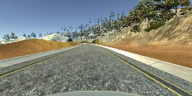

# **Behavioral Cloning** 

The goals / steps of this project are the following:
* Use the simulator to collect data of good driving behavior
* Build, a convolution neural network in Keras that predicts steering angles from images
* Train and validate the model with a training and validation set
* Test that the model successfully drives around track one without leaving the road
* Summarize the results with a written report

[//]: # (Image References)

[image1]: ./examples/left.png "Left Image"
[image2]: ./examples/right.png "Right Image"
[image3]: ./examples/center.png "Center Image"
[image4]: ./examples/normal.png "Normal Image"
[image5]: ./examples/flipped.png "Flipped Image"
[image9]: ./examples/crop.png "Cropped Image"
[image10]: ./examples/resize.png "Resized Image"

---
### Files Submitted & Code Quality

#### 1. Submission includes all required files and can be used to run the simulator in autonomous mode

Poject includes the following files:
* model.py containing the script to create and train the model
* drive.py for driving the car in autonomous mode
* model3.h5 containing a trained convolution neural network 
* writeup_report.md or writeup_report.pdf summarizing the results
* run1.mp4 has the video of running one lap in Track 1 successfully

#### 2. Submission includes functional code
Using the Udacity provided simulator and my drive.py file, the car can be driven autonomously around the track by executing 
```sh
python drive.py model3.h5
```

#### 3. Submission code is usable and readable

The model.py file contains the code for training and saving the convolution neural network. The file shows the pipeline used for training and validating the model, and it contains comments to explain how the code works.

### Model Architecture and Training Strategy

#### 1. An appropriate model architecture has been employed

The model implemented is the [COMMA.ai Model](https://arxiv.org/abs/1608.01230)

The model consist of one 8 by 8 filter, and two 5 by 5 filters, with depth ranging from 16 to 64. The model includes ELU layers to introduce nonlinearity, and the data is normalized within the model using a Keras lambda layer [model.py  Line 118]. 

#### 2. Attempts to reduce overfitting in the model

The sample data was randomly divided into training (80%) and validation (20%) sets to ensure that the model was not overfitting. The model was tested by running it through the simulator and ensuring that the vehicle could stay on the track. No addiional changes were made to the COMMA.ai model. As can be seen from the training and validation loss, model does not overfit for any epohcs and loss is very small.  

Epoch 1/3
20000/20000 [==============================] - 5796s - loss: 0.0269 - val_loss: 0.0169

Epoch 2/3
20000/20000 [==============================] - 5794s - loss: 0.0179 - val_loss: 0.0145

Epoch 3/3
20000/20000 [==============================] - 5846s - loss: 0.0158 - val_loss: 0.0129

#### 3. Model parameter tuning

The model used an adam optimizer, so the learning rate was not tuned manually (model.py line 136).

#### 4. Appropriate training data

Training data used was the one provided by Udacity, no additioal data was collected, rather relied healivy on data augmentation. Images from center, left and right camera was utilized to also increase sample size. 

For details about how training data was created, see the next section. 

### Model Architecture and Training Strategy

#### 1. Solution Design Approach

After data augmentation and preprocessing (see next section), both the NVIDIA and COMMA.ai model were evaluated. NVIDIA had the tendency to overfit, so went for COMMA.ai which didn't overfit and model was lighter to produce faster output. 

In order to gauge how well the model was working, image and steering angle data were split into a training and validation set. The model was run for 3 ephocs with 20000 samples per epoch and batch size of 64 [model.py Line 139-144] using keras generator. Model had low mean squared error on the training and validation set. This implied that the model was not overfitting. 

The final step was to run the simulator to see how well the car was driving around track one. The vehicle is able to drive autonomously around the track without leaving the road. 

#### 2. Final Model Architecture

The final model architecture (model.py lines 115-130) consisted of a convolution neural network with the following layers and layer sizes.

|Layer (type)             									 |Output Shape| 
|------------------------------------------------------------|------------|
|Lambda    				  									 |(64, 64, 3) | 
|Convolution (Filter: 8 X 8, Stride: 4 X 4, Activation: ELU) |(16, 16, 16)|  
|Convolution (Filter: 5 X 5, Stride: 2 X 2, Activation: ELU) |(8, 8, 32)  |  
|Convolution (Filter: 5 X 5, Stride: 2 X 2, Activation: ELU) |(4, 4, 64)  |          
|Flatten         											 |1024        |  
|Dropout (prob = .2)        								 |1024        |  
|Activation (ELU)          									 |1024        | 
|Fully Connected (Activation: ELU)        				     |512         |    
|Dropout (prob = .5)          								 |512 	      |    
|Activation (ELU)          									 |512         |  
|Fully Connected         				     				 |1 (Steering)|  
           

#### 3. Creation of the Training Set & Training Process

Only sample data provided by Udacity was used, no additional data was collected. The sample data is only collected from Track 1 with bias for steering_angle near 0. To generalize, relied on data augmentation. 

Here are examples of a drving image from left, right and center camera:

![alt text][image1] ![alt text][image2] ![alt text][image3]

Data Augmentation:

1. Center, left or right image was randomly chosen, when left image was chosen a recover steering angle of .2 was added, when right image was chosen .2 was subtracted from the steering angle [model.py Line 33-40]. This was done because we only have steering angle from center image. To increase the dataset recovery image was added using this technique.  

2. Image was randomly flipped 50% of the time, with steering angle value being multiplied by -1, the images provided have left turn bias, to generealize images were randomly flipped to also simulate rigth turns. Below is an original and flipped image [model.py Line 42-46].

![alt text][image4] ![alt text][image5]

Data Preprocessing:

1. To focus just on the road the top 60 pixels and bottom 25 pixels were cropped [model.py line 22-23].Below is an original and cropped. 

![alt text][image4] ![alt text][image9]

2. Images were resized to 64 by 64 for faster computation [model.py line 25-26]. Below is an original and resized. 

![alt text][image4] ![alt text][image10]

I used this training data for training the model. The validation set helped determine if the model was over or under fitting. Data augmentation and preprocessin was applied to the tranining data, while only preprocessing was applied to validation data using batch_generator [model.py line 84-101]. The number of epochs was 3, with sample size of 20000 in each epoch to ensure all left, right and center had a turn of being selected. Number of epochs was chosen to save on time and computation resources, since model was taking over 5 hours. I used an adam optimizer so that manually training the learning rate wasn't necessary.

#### 4. Lake Track: Model making comeplete 1 lap without veering off track. 

[](https://www.youtube.com/watch?v=BVe-r_XXTPQ)


